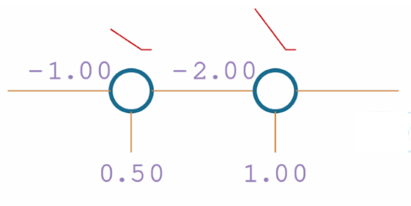

# Activation Functions

## Definition

A neuron has two states either activated or deactivated. The purpose
of an activation function is to judge whether to activate a neuron.

## Linear Activation Function

An example for linear activation function would be $y = x$ where the
inputs are the same as the outputs. **A linear activation function will
eventually yield a linear relationship no matter how many hidden layers
there are.**

Suppose there's a fully connected network with (1:3:3:1) architecture
and we want to train this network to fit in $y = sin(x)$ with the
activation function of $y = x$.

In the first hidden layer, the output of each neuron is the linear
combination of a single input, analogous to [$k_1 x + b_1$, $k_2 x + b_2$,
$k_3 x + b_3$], which serve as the inputs to the second hidden layer.

The second hidden layer then does nothing more than taking a linear
combination of the input list leading to another list of outputs similar to
[$w_1 x + b_1$, $w_2 x + b_2$, $w_3 x + b_3$].

Adding these outputs together leads us to a linear result: $p x + b$.

## ReLU Activation Function

### Definition

The ReLU activation function may be easier than you might have assumed.

$$
y = \begin{cases}
    x & \text{if } x > 0 \\
    0 & \text{if } x \leq 0
    \end{cases}
$$

The neuron will fire if it's greater than 0 otherwise it shall deactivate.

### Single Neuron

Imagine a single neuron with `weight=-1` and `bias=0.5`. What will the
output be after the ReLU activation function?

By definition, we may write:

$$
output = \begin{cases}
         -x+0.5 & \text{if } -x+0.5 > 0 \\
         0 & \text{if } -x+0.5 \leq 0
         \end{cases}
$$

which is:

$$
output = \begin{cases}
         -x+0.5 & \text{if } x < 0.5 \\
         0 & \text{if } x \geq 0.5
         \end{cases}
$$

### Chained Neurons

Now suppose there're two neurons, one with `weight=-1` and `bias=0.5`
and the other with `weight=-2` and `bias=1`.

<figure markdown="span">
  { width="300" }
  <figcaption>Fig1. Chained Neurons</figcaption>
</figure>

The original input goes into the first neuron and output it as:

$$
output = \begin{cases}
         -x+0.5 & \text{if } x < 0.5 \\
         0 & \text{if } x \geq 0.5
         \end{cases}
$$

This output serves as the input for the second neuron, and the eventual
output will be:

$$
output = \begin{cases}
         1 & \text{if } x \geq 0.5 \\
         2x & \text{if } 0 < x < 0.5 \\
         0 & \text{if } x \leq 0
         \end{cases}
$$

### Area of Play

In the single neuron example, our focus falls on when the neuron will be
activated. With multiple neurons, however, we shall turn our focus into
when both (all) neurons will be triggered.

The eventual output function depicted in chained neuron example is a piecewise
function, in which the function output remains unchanged either when $x > 0.5$
or when $x <= 0$.

Either case denotes that at least one of the neurons is presumed dead (deactivated)
through layers of calculation. For example, when $x = 1$, the first neuron is
deactivated ($\geq 0.5$); when $x=-1$, the second neuron is deactivated ($\leq 0$).

Thus, we invent a term for the range of values where both neurons are activated
-- area of play. Only when the input value falls within the area of play, the
network's output is then considered active. Otherwise, we peg them stagnant.

## Softmax Activation Function

The softmax activation function is used to calculate the confidence on each
output value (i.e. how much certainty do you have on this prediction).

$$
S_i = \dfrac{e^{x_i}}{\sum_{j=1}^{n}e^{x_j}}
$$

Thus, we only need to perform $y = e^x$ on every output and work out the
proportion. But there's one trick under the hood.

The $y = e^x$ function grows exponentially for every $x \geq 0$. From the view
of coding languages, this exponential growth will soon lead to an overflow in
integer (or double). To negate this, we can capitalize on this invariant:
$e^{x-y} = \dfrac{e^x}{e^y}$.

To be more specific:

$$
S_i = \dfrac{e^{x_i - x_{max}}}{\sum_{j=1}^{n}e^{x_j - x_{max}}}
$$

where $x_{max}$ is the maximum among $x_1, x_2, x_3 ... x_n$.

## NumPy: axis

Working with NumPy axis requires us to abstract arrays with higher dimensions
rather than visualize it.

Suppose we have an NumPy array with shape `(4, 2, 3, 5)`, a four-dimensional
array. The term **axis** represents each dimension. Axis 0 would mean the first
dimension of the array, 1 means the second dimension and so on. Since NumPy uses
tuple to describe the shape, like any other Python sequences, axis -1 denotes
the last element, or the last dimension in the array.

With the above knowledge, we're no longer confined to visualizing an array with
however many dimensions. We exploit it by each dimension with NumPy axis.

### Example: `np.sum`

```Python
a = np.array(
    [
        [
            [[1, 2, 3, 4, 5], [2, 3, 4, 5, 6]],
            [[2, 3, 4, 5, 6], [3, 4, 5, 6, 7]],
            [[4, 5, 6, 7, 8], [5, 6, 7, 8, 9]],
            [[6, 7, 8, 9, 10], [7, 8, 9, 10, 11]],
        ],
        [
            [[1, 2, 3, 4, 5], [2, 3, 4, 5, 6]],
            [[2, 3, 4, 5, 6], [3, 4, 5, 6, 7]],
            [[4, 5, 6, 7, 8], [5, 6, 7, 8, 9]],
            [[6, 7, 8, 9, 10], [7, 8, 9, 10, 11]],
        ],
    ]
)

print(np.sum(a))
print(np.sum(a, axis=0))
print(np.sum(a, axis=1))
print(np.sum(a, axis=2))
print(np.sum(a, axis=3))

print(np.sum(a, axis=0, keepdims=True))
print(np.sum(a, axis=1, keepdims=True))
print(np.sum(a, axis=2, keepdims=True))
print(np.sum(a, axis=3, keepdims=True))
```

If no axis value is specified, the `np.sum` function will simply return
the sum of all elements in the array.

If an axis value is specified:

**Without `keepdims`:**

NumPy will simply collapses the specified dimension. By "collapse", it
means NumPy will walk through the array dimension by dimension until the
specified axis is reached. Then it performs an element-wise addition
on whatever remains.

For example, if `axis=1`, NumPy goes to the second pair of brackets and add
all the elements within.

```Python
[
    [[1, 2, 3, 4, 5], [2, 3, 4, 5, 6]],
    [[2, 3, 4, 5, 6], [3, 4, 5, 6, 7]],
    [[4, 5, 6, 7, 8], [5, 6, 7, 8, 9]],
    [[6, 7, 8, 9, 10], [7, 8, 9, 10, 11]],
]


# Output
[[13 17 21 25 29], [17 21 25 29 33]]
```

Also notice that, if you specify an axis value but doesn't keep the dimension,
the specified dimension will vanish.

For example, `a`'s shape is `(2, 4, 2, 5)`. If `axis=1`, the result shape will
be `(2, 2, 5)`.

**With `keepdims`:**

If `keepdims` is specified to `True`, there won't be a vanishing dimension.
Rather, the specified dimension represented by `axis` will be replaced by 1.

For example: `np.sum(a, axis=1, keepdims=True).shape` will be `(2, 1, 2, 5)`.
